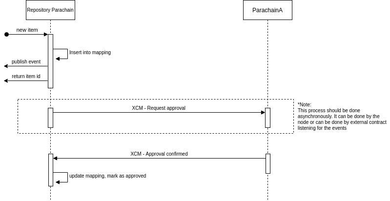

# cross-chain-repository
This is a simple exercise demoing how to create a cross chain repository using substrate

The following diagram is a sequence diagram of this exercise.

Link to the DrawIO: https://app.diagrams.net/#G106cG92pQsoy1HXEdVs9sF0KVOmxjH98f

The idea is that, the `Repository Parachain` is storing the metadata in all the 
participant parachain. It requires a confirmation signal from the participants 
to have the metadata as accepted in the `Repository Parachain`.

The repository is only tracking the id of the object. The actual content can be 
stored somewhere else. That matter is not crucial for the purpose of this exercise.

To research:
- Substrate trigger aync process without external software?

For the purpose of this exercise, it will focus mainly on the XCM portion.

## Dev Plan
- One day for the repository pallet implementation
- One day for the parachains + relay chain setup and testing
- Two to three days for the XCM testing

Potential risk: The XCM for general purpose exchange of information needs to be 
tested.